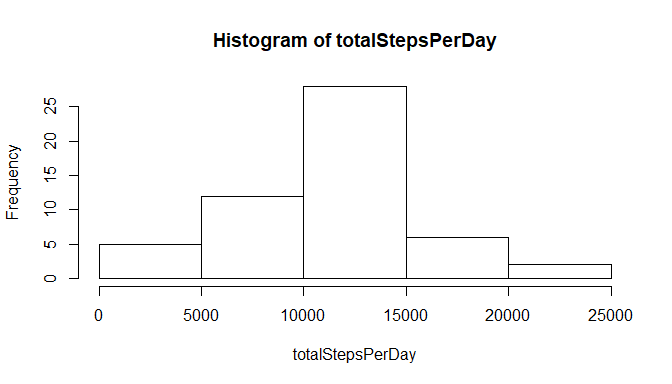
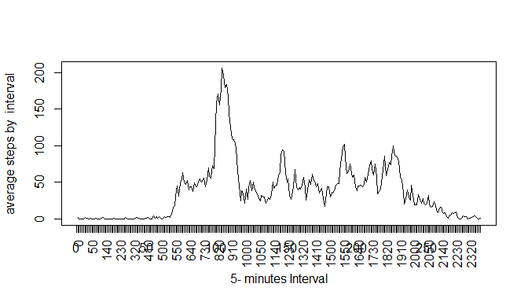
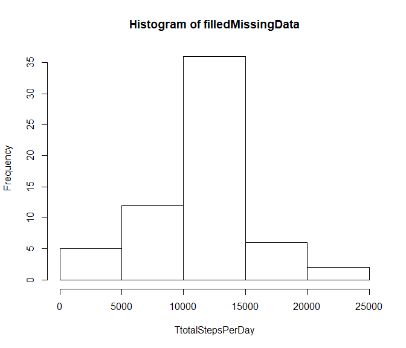
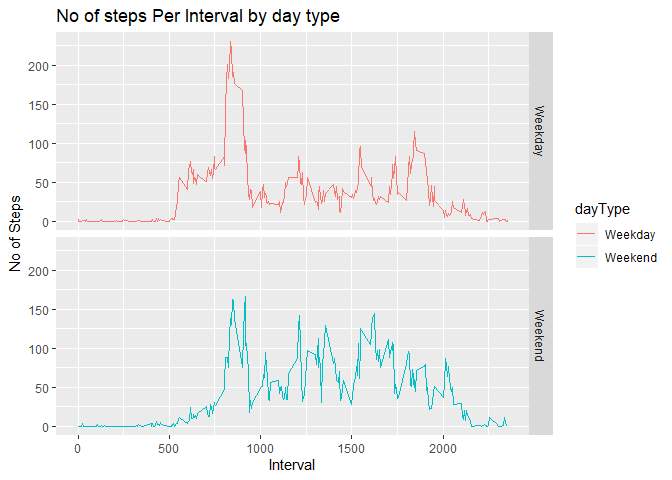

## Loading and preprocessing the data

I need to delete the rows with NAs values


```r
DF<-read.csv("activity/activity.csv", header = TRUE)
newDF<-na.omit(DF)
```

## What is mean total number of steps taken per day?

First I make a histogram of the total number of steps taken each day, with the next code:


```r
totalStepsPerDay<-tapply(newDF$steps, newDF$date, sum)
hist(totalStepsPerDay)
```

<!-- -->

Code chunck for the mean total number of steps taken per day.


```r
 mean(totalStepsPerDay, na.rm = TRUE)
```

```
## [1] 10766.19
```

Code chunck for the median total number of steps taken per day


```r
 median(totalStepsPerDay, na.rm = TRUE)
```

```
## [1] 10765
```

## What is the average daily activity pattern?

First is necesary to convert the variable Interval in a Factor, next calculate the mean of steps by intervals. Here's the code:


```r
 newDF$interval<-as.factor(newDF$interval)
 a<-tapply(newDF$steps, newDF$interval, mean)
 plot(a, type='l', xlab="5- minutes Interval", ylab = "average steps by  interval")
 axis(1, at =  newDF$interval, labels = newDF$interval, las=2)
```

<!-- -->


The 5-minute interval, on average across all the days in the dataset, contains the maximum number of steps, is the 835 interval and is calculate with the next code chunck:


```r
names(a)[which.max(a)]
```

```
## [1] "835"
```


## Imputing missing values

The total number of missing values in the dataset is calculate with the next code:


```r
NAsRows<-sum(is.na(DF))
```

So there are 2304 rows with missing values.

To filling  all of the missing values in the dataset it was used the mean for  that 5-minute interval, that was calculate in the a variable, it´s necesary to work with DF dataframe. 


```r
DF$steps[which(is.na(DF$step)==TRUE)]<-a[as.character(DF$interval[which(is.na(DF$step)==TRUE)])]
```

So **DF** is the new dataset without missing values. 


```r
filledMissingData<-tapply(DF$steps, DF$date, sum)
hist(filledMissingData, xlab="TtotalStepsPerDay")
```

<!-- -->

Code chunck for the mean total number of steps taken per day with missing values


```r
 summary (totalStepsPerDay)
```

```
##    Min. 1st Qu.  Median    Mean 3rd Qu.    Max.    NA's 
##      41    8841   10765   10766   13294   21194       8
```

Code chunck for the median total number of steps taken per day without missing values


```r
 summary(filledMissingData)
```

```
##    Min. 1st Qu.  Median    Mean 3rd Qu.    Max. 
##      41    9819   10766   10766   12811   21194
```

As observed,  the values of mean and median do not differ from the estimates. But in the histogram the steps per day values had an impact increasing their frecuency. 

## Are there differences in activity patterns between weekdays and weekends?

For this part the weekdays() function may be of some help here. Use the dataset (DF) with the filled-in missing values for this part.

1. Create a new factor variable in the dataset with two levels -- "weekday" and "weekend" indicating whether a given date is a weekday or weekend day


```r
week_day <- function(date) {
    wd <- weekdays(as.Date(date))
    if  (!(wd == 'Saturday' || wd == 'Sunday')) {
        result <- 'Weekday'
    } else {
      result <- 'Weekend'
    }
    result
}
```

Apply the function to create a new column in the dataset of factor type.


```r
DF$dayType<-as.factor(sapply(DF$date, week_day))
```

2. Make a panel plot containing a time series plot (i.e. type = "l") of the 5-minute interval (x-axis) and the average number of steps taken, averaged across all weekday days or weekend days (y-axis). 


```r
library(ggplot2)

# Create the aggregated data frame by intervals and day_type
stepsPerDay<- aggregate(steps ~ interval+dayType, DF, mean)

# Create the plot
grafic <- ggplot(stepsPerDay, aes(interval, steps)) +
    geom_line(stat = "identity", aes(colour = dayType)) +
    theme_gray() +
    facet_grid(dayType ~ ., scales="fixed", space="fixed") +
    labs(x="Interval", y=expression("No of Steps")) +
    ggtitle("No of steps Per Interval by day type")
print(grafic)
```

<!-- -->
